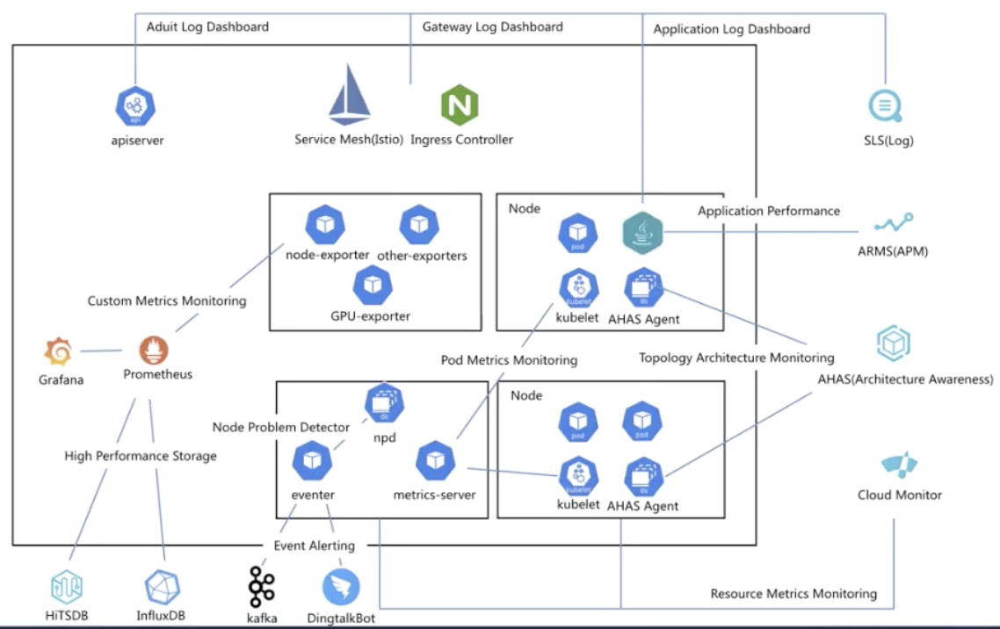

# cncf cloudnative 云原生

- [云原生 landscape](http://l.cncf.io)
- [aliyun - 云原生](https://developer.aliyun.com/group/cloudnative)
- 百度网盘-CloudNative云化架构.pdf

## cncf

- trailMap: container容器化(docker) cicd(argo) app(k8s+helm) observe(opentracing/jaeger prometheus fluentd) mesh(istio envoy/linkerd coredns) net(CNI falco) data(vitess rock etcd tikv) rpc(grpc nats cloudevents) runtime(CRI-O harbor containerd)

## k8s doc

> <http://docs.kubernetes.org.cn>

- 是什么
- 设计文档: 架构 设计理念 实现细节
- 概念
- kubectl
- k8s api
- 互动教程 tasks
- minikube 安全 集群管理

## 云原生架构白皮书

> <https://developer.aliyun.com/topic/cn-architecture-paper>

- aliyun 产品
  - 微服务: EDAS MSE ACM CSB GTS ARMS TA PTS
  - serverless: FC SAE 工作流
  - service mesh: ASM AHAS chaos-mesh
  - MQ: rocketMQ kafka AMQP MQTT MNS EventBridge
  - 云原生DB: polar ADS

## 云原生技术公开课

- <https://developer.aliyun.com/learning/roadmap/cloudnative>


### 云原生基础

- 云原生
  - 6个技术范畴
    - 定义与开发流程: image CI/CD msg streaming db
    - 编排与管理: k8s 应用编排管理与调度 服务发现治理 远程调用 api网关 service-mesh
    - 监控与可观测性: 监控 日志收集 tracing 破坏性测试 混沌工程
    - 底层技术: 容器运行时 存储 网络
    - 工具集: 流程自动化 配置管理 容器镜像仓库 安全 密码管理
    - serverless
  - 2个理论: 不可变基础设施 应用编排(容器设计模式)
  - 4个关键技术: 镜像 快速部署与隔离 基础设施自动化管理 管控系统和支撑组件
- k8s 云时代的OS
  - 6个核心功能
    - 服务发现与负载均衡
    - 容器自动装箱 scheduling 调度
    - 恢复
    - 发布 回滚 配置管理
    - job 型任务
    - 水平伸缩
  - 架构
    - master(server): api-server controller(状态管理) scheduler etcd
    - node(client): pod kubelet container-runtime storage-plugin network-plugin kube-proxy
  - 核心概念: pod(应用) volume deployment(应用发布) service(clusterIP nodePort LB) namespace
  - api: http+json/yaml label
- pod
  - k8s=os pod=进程组 container=进程
  - pod=原子调度单位 `task co-scheduling`问题
  - pod=超亲密关系 affinity=亲密关系(调度到相同 node)
  - 共享网络: pod生命周期=`infra container`(`k8s.gcr.io/pause`)生命周期
  - 共享存储: pod level volume
  - 容器设计模式 sidecar: 将辅助功能同主业务解耦, 实现独立发布和能力重用
    - initContainer: jar-intContainer -> volume -> tomcat-container
    - log proxy adapter(接口转换)
  - 设计模式的本质: 解耦与重用
- compose 编排
  - 核心原理
    - kind 资源: spec-期望的状态 status-观测到的状态 template-所需资源模板
    - metadata 元信息:
      - labels-资源识别-selector
      - annotation-资源注解 扩展 spec/status
      - ownerReference-资源关系 replicaSet/statefulSet
    - 控制器模式: 声明式api-状态 vs 命令式api-过程
  - deployment: deployment-replicaSet-pod maxavailable/maxsugar/revisionHistoryLimit/MinReadySeconds
  - job: job-pod restartPolicy/backoffLimit completions/parallelism
  - cronJob: schedule/startingDeadlineSeconds/concurrencyPolicy/JobsHistoryLimit
  - daemonSet: daemonSet-pod 守护进程(每个 node 都包含) 存储/日志/监控 RollingUpdate/OnDelete
- 配置管理
  - configMap-可变配置 env/argument/volume
  - secret-敏感信息
  - serviceAccount-身份认证
  - resources-资源配置 request/limit Guaranteed/Burstable/BestEffort
  - securityContext-安全管控
  - initContainer-前置校验
- volume 存储
  - pod volume
  - PV-volume定义
  - PVC-大小/访问方式(node level)
- snapshot 数据快照(快速 restore) & topolopy 拓扑(node 位置)
- 可观测性:
  - health check: Liveness/Readiness-httpGet/exec/tcpSocket
  - 监控: 资源/性能/安全/事件 metric-server prometheus-接口监控标准 kube-eventer-事件离线工具
  - 日志: kernel runtime(docker) 核心组件(etcd/api-server/kubelet) stdout->远端(sls FEk FIG)
- network
  - 约定: pod互通 node-pod互通 pod看到的ip和别人看到ip相同
  - 目标: 外部-svc svc-pod pod-pod pod内容器
  - underlay/overlay(是否与host同层) netns(net namespace 网络空间隔离) 典型容器网络实现方案 networkPolicy
- service: 服务发现/负载均衡 集群内-ip/服务名/环境变量 集群外-nodePort/LB
- helm



```yaml
# k8s api
apiVersion: v1
kind: pod
metadata:
    name: nginx
    labels: # 供 selector 使用
        name: nginx
    annotation: # 额外功能
spec: # 对应 kind 的具体描述, 调度后会有 status 字段
    containers:
    - name: nginx
      image: nginx
      ports:
      - containerPort: 80
```

### 云原生进阶

- linux 容器: `namespace + cgroup` -> 资源隔离; overlay fs -> 镜像存储; docker + containerd -> 容器引擎如何工作
- etcd:
  - Raft 分布式一致性算法; leader+quorum(超过集群半数节点的团体);
  - api;
  - 数据版本; MVCC & streaming watch; mini-transaction
  - lease 租约, 检测节点是否存活
  - 典型场景: 元数据存储; server discovery(naming service); 选主(leader election); 分布式系统并发控制
  - 性能优化: server-硬件/部署/内核/算法 client-最佳实践(k8s crd/node/event)
- k8s调度
  - 合适: pod资源要求 资源合理利用 pod关系要求 node限制条件
  - QoS(quality of service): guaranteed/burstable/besteffort request/limit
  - resourceQuota: 限制 namespace 中资源的使用
  - pod亲和度: podAffinity/podAntiAffinity(required/preferred)
  - pod与node: NodeSelector/NodeAffinity taints/Tolerations
  - 优先级调度: priority(FIFO/priority) preemption
  - 调度流水线 schedule pipeline: 调度器 wait bind;
    - 调度算法
      - 过滤器 predicates: 存储 pod&node pod&pod pod打散
      - priority: 碎片 容灾 水位 亲和 反亲和
    - 配置调度器: provider/file/configmap
- GPU & device plugin
- k8s存储架构与插件
- statefulSet: statefulSet -> pod
- k8s api 编程范式: CRD customResourceDefinition
- k8s api 编程利器 operator = CRD + webhook + controller
- k8s 网络: PerPodPerIP 4层网络模型 ingress+clusterIP+podIP
- CNI container network interface
- k8s 安全之访问控制: 认证(base/x509) RBAC security-context 多租安全加固
- CRI container runtime interface: 实现(CRI-O CRI-containerd) 工具(cri-tools critest)
- 安全容器: 应用容器vs安全容器 linux-ABI 间接层 kata-云原生虚拟化 gVisor-进程级虚拟化
- RuntimeClass: 多CR支持


## service mesh: istio

> <https://istio.io/latest/zh>

- 必要性
  - CICD: 敏捷迭代 快速交付
  - api gateway: 松耦合 安全开放
  - app: 可观测性 数据一致性
  - 中间件: 故障自愈 运维自动化
  - 容器: 平台无关性 弹性伸缩
- 特性
  - 流量管理: 规则配置+流量路由
    - 服务级属性(熔断/超时/重试)
    - ab测试/金丝雀发布/流量按百分比进行发布
    - 对流量的可视性 + 故障恢复特性(对应用透明)
  - 安全: 服务通信 认证/授权/加密
  - 可观察性 -> 加强服务的 SLO
    - 追踪/监控/日志
    - mixer 组件: 策略控制/遥测数据
- 实现
  - 流量管理
    - VirtualService:
      - route
        - 流量分发: host + subset
        - timeout
        - retries
      - fault 故障注入
      - 绑定 Gateway: gateways + hosts
    - DestinationRule:
      - host -> subset -> pod
        - LB: host / subset
        - trafficPolicy 熔断器: subset
      - 绑定 serviceEntry: host
    - Gateway
      - 管理流量入口: 外部 servers -> hosts
    - ServiceEntry
      - 注册外部服务到 istio: xxx -> hosts
    - Sidecar
      - 微调 Envoy 代理: hosts
  - 可观测性
    - 指标 metric: 4个监控黄金标识 -- 延迟/流量/错误/饱和
      - 代理级别指标 Envoy
      - 服务级别指标 `istio_requests_total` -> Prometheus
      - 控制面板指标 Pilot/Galley/Mixer/Citadel
    - 分布式追踪
      - Envoy 自动生成 span -> zipkin/jaeger/lightStep/Datadog + 采样率
    - 访问日志: 本地 / Fluentd

## serverless

- cloudbase <https://docs.cloudbase.net/> <https://github.com/Tencent/cloudbase-framework> <https://github.com/TencentCloudBase/cloudbase-action>
- Serverless Framework: <https://cloud.tencent.com/document/product/1154/41775>

## kubectl

- 查看字段: `kubectl explain`; `dash > user contribute | k8s > podspec`

```sh
kubectl apply -f
kubectl delete
kubectl api-resources # 查看 k8s resource(shortname)
kubectl completion # fish 有插件支持
kubectl explain pod.spec.affinity.podAffinity
kubectl run --image=nginx my-deploy -o=yaml --dry-run > my-deploy.yml
kubectl get statefulset/foo -o=yaml --export > new.yml
kubectl config set-context --current --namespace=env-dev-php # 切换 namespace

# pod
kubectl get pods --all-namespaces -o=jsonpath="{..image}" -l app=nginx
kubectl get pods --all-namespaces -o jsonpath="{.items[*].spec.containers[*].image}"

# debug
kubectl exec -it pod-name -- cmd # -c container
kubectl port-forward svc/pod 3000:80 # curl localhost:3000
kubectl run cirros --rm -it --image=cirros -- sh
kubectl exec -ti pod-name -- sh
https://www.telepresence.io/ # 通过 vpn 的方式, 将本地 shell 挂载到 k8s 内
kubectl port-forward
kubectl-debug

# kt-connect: https://alibaba.github.io/kt-connect/#/zh-cn/
ktctl connect # KT proxy start successful
curl podIP/clusterIP/svc:8080 # 直接访问
```

## helm

> <https://github.com/cloudnativeapp/handbook>
> <https://helm.sh>

核心概念:

- helm: k8s 包管理工具
- chart: helm 中定义的 k8s 的应用包, 由 k8s svc/deploy 等 yaml 文件组成
  - 相关命令: create lint package upgrade install `show values`
- release: 运行态的 chart
  - 相关命令: install ls uninstall status upgrade rollback history
- hub/repo: chart 的仓库

helm 功能:

- 包管理
- 滚动升级

```sh
helm create xxx
helm lint --strict xxx
helm package xxx # 打包好的成为 chart
helm upgrade xxx # chart.yaml > version
helm install chart-xxx xxx # 安装到 k8s 中
kubectl port-forward podname 8080:80 # curl localhost:80

helm repo add stable https://kubernetes-charts.storage.googleapis.com/
helm search repo stable
helm repo update
helm install stable/mysql --generate-name
helm ls
helm uninstall smiling-penguin --keep-history
helm status smiling-penguin
```

## knative

- knative-sample: <https://knative-sample.com/>
- knative-doc: <https://knative.dev/docs/>

## dev

- [minikube](https://minikube.sigs.k8s.io)
- [MicroK8s - Zero-ops Kubernetes for developers, edge and IoT](https://microk8s.io)
- [K3s: Lightweight Kubernetes](https://k3s.io)

## mark

- edx: <https://www.edx.org/course/introduction-to-kubernetes>
- 高可用 = k8s + 微服务 + devops
- OpenStack + k8s(serviceMesh) + 管理后台
- 计算机科学界只有两个真正的难题——缓存失效和命名 -- Phil Karlton
- Secure as VM, Fast as Container
- 要实施 DevOps，需要遵循一些基本原则，这些原则被简写为 CAMS: culture automation measurement sharing

## 资料

- kubernetes 权威指南
- kubernates cookbook
- Kubernetes Microservices with Docker
- Borg: the Next Generation
- [kubernetes 指南](https://kubernetes.feisky.xyz/)
- [edx - kubernetes](https://www.edx.org/course/introduction-to-kubernetes)
