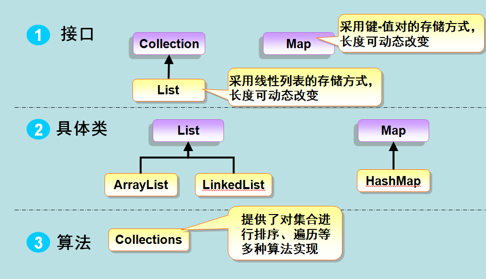

# java

- why: 终生编码肯定绕不开java; 招聘平台架构师岗位
- env: install config ide
  - version: 14 11 8
  - run/debug: 入口`public static void main(String[] args)`; 源码`.java`>字节码`.class`>解释器(java虚拟机)>os>硬件
    - java javac
- syntax: comment /CompoundType var expr op ctl fn OO package err
  - scope: default=包内可见
  - keyWord: final abstract static synchronized transient volatile
  - type
    - basic: boolean byte short/char int/float long/double String
    - 包装类: long=>Long int->Integer/AtomicInteger
    - Number&Math Character String/StringBuffer/StringBuilder Array
    - Date Calendar [GregorianCalendar]<https://www.runoob.com/java/java-date-time.html>)
    - Pattern Matcher PatternSyntaxException
    - Stream File IO Scanner
    - Enumeration BitSet Vector Stack Dictionary Hashtable Properties
    - 泛型 注解 reflect
  - op: `?: instanceof`
  - err&log: Logback log4j
- fn
  - basic: java.lang java.text HashMap
  - java.util
    - concurrent J.U.C: tool(Executors Exchanger Semaphore CountDownLatch CyclicBarrier) lock atom collection
      - AbstractQueuedSynchronizer ConcurrentHashMap CountDownLatch/CyclicBarrier
  - collection集合: List Set Map
  - IO stream AIO: java.io java.nio ReactorStreams
  - multiThread多线程
  - net/server: Socket URL httpClient rpc(dubbo) http(tomcat=bio+apr)
    - dubbo: SPI机制/adaptive原理
    - netty: NIO=EventLoop 自定义协议=codec bootStrap pipeline大动脉 promise+future byteBuf内存分配
  - view(Thymeleaf jsp velocity FreeMaker beetle) GUI(java.awt javax.swing)
  - 序列化Serializable
  - model
    - JDBC(java.sql) -> hibernate(不写一句sql)/Mybatis(灵活调试sql) -> jpa
      - mybatis: 二级缓存 插件=扩展
      - druid连接池
    - DAO`UserRepository extends JpaRepository<User, Long>`
    - @Entity`User implements Serializable`
    - more: `@Component @Scheduled`
  - Jedis全面redis命令支持 Redisson官方推荐
  - [thread多线程](../../src/java/ThreadDemo/readme.md)
- project
  - dep: 模块化系统?
  - matadata: group.artifact(com.baidu demo) version
  - [tool](../blog/java_tool.md): maven/pom.xml gradle ant jar war
    - [junit](https://www.imooc.com/view/356)
  - [spring](../blog/java_spring.md)
- core
  - java9新特性之核心库 java设计模式
- eco
  - [阿里巴巴java](https://developer.aliyun.com/learning/roadmap/java)
  - [阿里巴巴微服务](https://developer.aliyun.com/learning/roadmap/microservice)
  - javaFX(客户端app)

```sh
# java: 安装 环境变量
brew install openjdk
# maven: 安装 环境变量 阿里源 https://www.jianshu.com/p/a43dacd4ab35
java -jar xxx.jar --xxSetting=xx
```

```java
// 顺序表
int[] arr = {1,2,3,4,5};
```

- 
- 
- 
- 
- 

## jvm java虚拟机

- 自动内存管理 jvm执行子系统 程序编译与代码优化 高效并发
- 语言: java kotlin scala groovy(动态)
  - scala: web(lift play) ms(akka) 响应式ms(lagom)
- intro介绍
  - 阵营
    - sun hotspot vm: 热点探测 准确式内存管理
    - BEA jRockit jdk11 zgc
    - dalvikVM; other
  - 执行引擎 mixedMode: jit 字节码解释
- 类加载
  - 过程(.class->vmMEM): load加载 -> link链接(verify验证 prepare准备 resolve解析) init初始化 using使用 unload卸载
  - type: boostrap=JRE.core extension=JRE.ext app=ClassPath 自定义
  - 机制: 全盘负责 双亲委派(沙箱 去重) 缓存
- runtimeMEM
  - 线程共享: 方法区(metaSpace `-XX:PermSize -XX:MaxPermSize`) heap(对象+数组 分代=old+new `-Xmx -Xms`)
  - 线程私有
    - stack `-Xss`
      - stackFrame栈帧: localVariableTable局部变量表 opStack操作数栈 dynamicLink动态链接 returnAddress方法返回地址
    - 程序计数器
    - 本地方法栈
- gc thread mem 4种应用 io模型(eio Channel/Buffer/Selector)
- 性能优化: OOM(heap溢出/泄露 Metaspace) tool(jps jinfo jstack jmap jvisualvm MAT分析dump文件 visualVM arthas jconsole)
  - 调优参数: `-XX:MaxGCPauseMillis`停顿时间 -XX:GCTimeRatio=`吞吐量

## noun

- ssh=struct(UL)+spring(BL)+hibernate(PL)
  - ul UILayer 展示成 controllerAction view
  - bl bussinessLayer 业务层 service
  - pl persistenceLayer 数据层/持久化层 DAO=repository
- se standradEdition; ee enterpriseEdition; jre runtimeEnv; jdk developKit
- POJO PlainOrdinaryJavaObject; PO persistantObject; VO valueObject; TO TransferObject; BO businessObject; DAO dataAccessObject; ORM Object/RelationalMapping; BOF BusinessObjectFramework 业务对象框架; SOA ServiceOrientArchitecture 面向服务的设计
- EMF Eclipse Model Framework Eclipse建模框架
- rapidApplicationDevelopment
- OGNL ObjectGraphNavigationLanguage 对象图导航语言
- EJB EnterpriseJavaBean
- JAR JavaArchive: 2种打包方式, 是否包含依赖
- YAML Ain'tMarkupLanguage
- BOSS Business&OperationSupportSystem
- OSGi openServiceGatewayInitiative 开放服务网关协议=java动态化模块化系统的一系列规范
- rmi remoteMethodInvocation 远程方法调用
