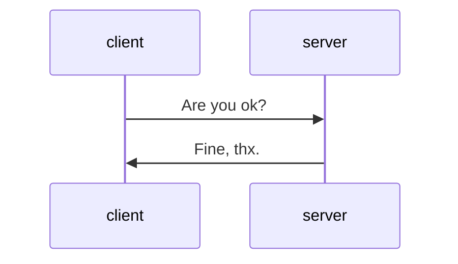
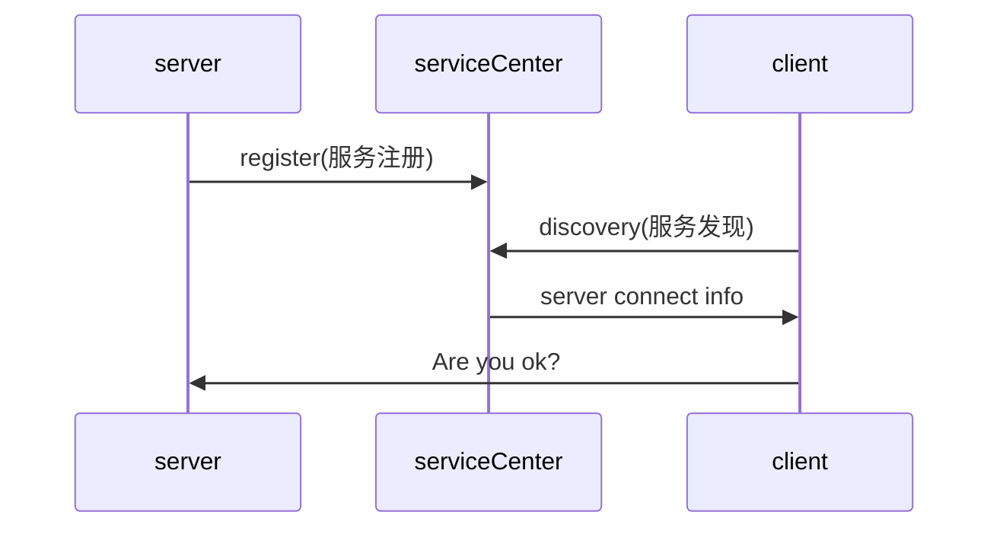
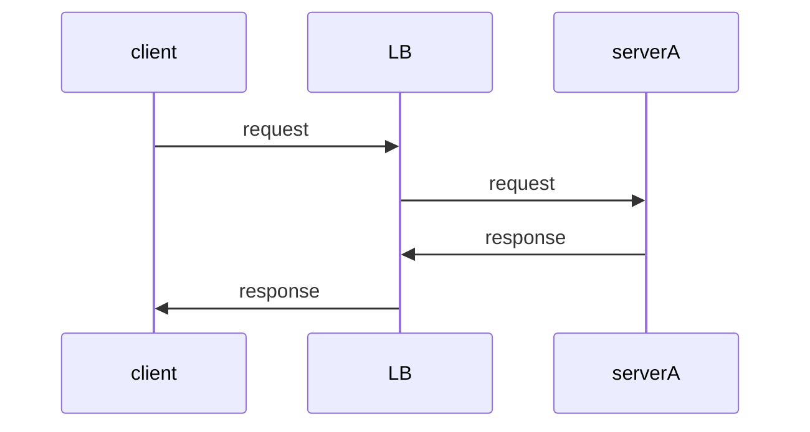
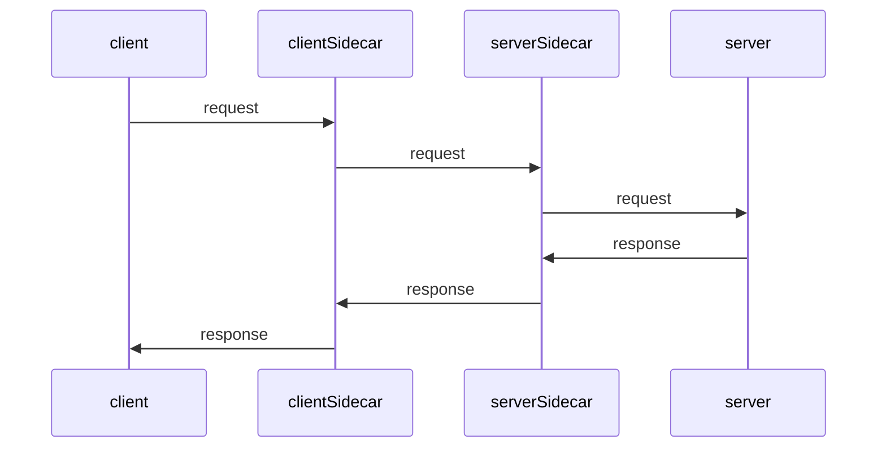
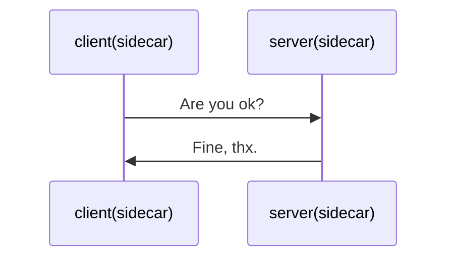

# devops| k8s: istio 入门
- [istio 入门](https://istio.io/latest/zh/docs/setup/getting-started/ "istio 入门")

在完成 k8s 上快速部署 go 服务后, 就可以假装 devops 的能力已经有了(**就是这么膨胀**), 接下来开始征战微服务

## 服务小百科

- 从最简单的开始



一起来看看, 会遇到哪些问题, 以及如何解决:

- 假设 client 数量为 M, server 数量为 N, 上面的问题规模为 $M*N$, 按照经典理论:

> 计算机科学领域的任何问题都可以通过增加一个间接的中间层来解决

引入 **服务注册与发现**



- 高可用下, 服务要避免 **单点** 故障

server 可以起多个实例, 多个实例组成集群, 集群前置负载均衡(LB)



还有这些问题:

- 熔断: client 太热情, server 扛不住, 需要对超出能力外的请求进行熔断, 或者说限流
- 重试: client 没有收到 server 的正常响应, 需要进行重试
- 链路监控: client / server 很多, 调用链复杂, 如何有效追踪和监控

还有很多 **非业务逻辑** 的问题, 就不一一列举了, 可以对照 **微服务1.0** 中的组件, 多问几句:

> 这个组件是什么(what)? 怎么用的(how)? 为什么需要这个组件(why)?

## 微服务1.0: spring cloud 全家桶

为了解决上面提到 **共性** 的问题, 先行者 **遇山劈山, 遇水架桥**, 提供 **类库和框架* 来解决, spring cloud 全家桶是里面的佼佼者

spring cloud
- spring-cloud-commons: 框架公共类库
- spring-cloud-netfix: netfix 提供的一整套解决方案
- spring-cloud-sleuth: 调用链
- spring-cloud-gateway: 网关
- spring-cloud-bus
- spring-cloud-consul
- spring-cloud-zookeeper
- spring-cloud-config
- spring-cloud-security
- spring-cloud-aws
- spring-cloud-cloudfoundry

netfix OSS
- eureka
- hystrix
- turbine
- archaius
- atlas
- feign
- ribbon
- zuul

除了 netfix, 还有其他产商也有对应的一整套解决方案, 比如 `spring-cloud-alibaba`, 同样是为了解决 **非业务逻辑** 的共性问题

> 灵魂拷问来了: 既然是非业务的共性问题, 做成 **基础设施** 岂不美哉?

## 微服务 2.0: service mesh 横刀立马

仔细一想, 这几年在基础设施领域, 可谓变革颇丰:

- 让算力成为基础设施 -- 云计算: 再也不用凌晨打电话给网管, 让他手动重启服务器了
- 让应用成为基础设施 -- 容器: 应用 = 程序 + 程序运行所需的环境, 让应用的交付更标准, 应用的迭代速度更快
- 让应用编排部署成为基础设施 -- k8s: 业务 = 应用编排 + 硬件资源资源池

到现在, `devops + k8s + 微服务` 全套理念越发完备, 工具链越发完善的今天, **服务治理**, 也可以成为基础设施

> 容器设计模式 sidecar: 将辅助功能同主业务解耦, 实现独立发布和能力重用

k8s 将 pod 作为最小调度单位, `pod = 一组容器组合 = 业务容器 + sidecar容器(非业务逻辑的辅助功能)`

有了 sidecar, `log proxy adapter` 等功能都可以轻松实现, 而不影响业务



sidercar容器是和业务容器部署在一起的, 最终:



有点 **分久必合合久必分** 的味道? 历史并不是那头拉磨的驴, 兜兜转转又回到了原点, 恰恰相反, 是走出了围墙, 可以看到更大的世界

终于到我们的主角登场了: service mesh 今日之星 -- `istio`

## istio 快速实践

- 安装

```sh
brew install istioctl
istioctl manifest apply # 安装 istio 到 k8s
kubectl get svc -n istio-system # 校验安装是否成功
kubectl get pods -n istio-system
```

- 上手 `bookinfo` demo

使用官方提供的 [bookinfo](https://raw.githubusercontent.com/istio/istio/release-1.7/samples/bookinfo/platform/kube/bookinfo.yaml "bookinfo demo")


```sh
kubectl label namespace default istio-injection=enabled # default 命名空间下开启 istio
kubectl apply -f bookinfo.yaml
kubectl get svc # 验证 bookinfo 服务

➜ kubectl get pod
NAME                              READY   STATUS    RESTARTS   AGE
details-v1-558b8b4b76-5p84p       1/1     Running   0          14h
productpage-v1-6987489c74-n7q7f   1/1     Running   0          14h
ratings-v1-7dc98c7588-9jdsv       1/1     Running   0          14h
reviews-v1-7f99cc4496-fxmrq       1/1     Running   0          14h
reviews-v2-7d79d5bd5d-m2lvf       1/1     Running   0          14h
reviews-v3-7dbcdcbc56-qbmkz       1/1     Running   0          14h

# 查看 productpage 服务, 端口是 9080
➜ kubectl logs productpage-v1-6987489c74-n7q7f
INFO:root:start at port 9080
 * Serving Flask app "productpage" (lazy loading)
 * Environment: production
   WARNING: Do not use the development server in a production environment.
   Use a production WSGI server instead.
 * Debug mode: on
INFO:werkzeug: * Running on http://0.0.0.0:9080/ (Press CTRL+C to quit)
INFO:werkzeug: * Restarting with stat
INFO:root:start at port 9080
WARNING:werkzeug: * Debugger is active!
INFO:werkzeug: * Debugger PIN: 808-256-567

# 进入一个容器, 测试一下 productpage 服务
kubectl exec -ti ratings-v1-7dc98c7588-9jdsv -- bash
root@ratings-v1-7dc98c7588-9jdsv:/opt/microservices# curl productpage:9080/productpage |grep -o '<title>.*</title>'
  % Total    % Received % Xferd  Average Speed   Time    Time     Time  Current
                                 Dload  Upload   Total   Spent    Left  Speed
100  4183  100  4183    0     0   8081      0 --:--:-- --:--:-- --:--:--  8090
<title>Simple Bookstore App</title>
```

开启 istio, 会使用 `sidecar` 模式自动注入, 最终部署结果如下:


PS: 图中 `Envoy` 的 istio 的网络功能组件

- 暴露 bookinfo 应用对外访问

还是使用官方提供的 [bookinfo-gateway](https://raw.githubusercontent.com/istio/istio/release-1.7/samples/bookinfo/networking/bookinfo-gateway.yaml)

```sh
kubectl apply -f samples/bookinfo/networking/bookinfo-gateway.yaml
kubectl get gateway # 验证网关
NAME               AGE
bookinfo-gateway   31s

# 查看 istio-ingressgateway
➜ kubectl get svc -n istio-system
NAME                   TYPE           CLUSTER-IP     EXTERNAL-IP   PORT(S)                                                      AGE
istio-ingressgateway   LoadBalancer   10.111.92.66   localhost     15021:30534/TCP,80:31508/TCP,443:31743/TCP,15443:30249/TCP   21h
istiod                 ClusterIP      10.97.248.42   <none>        15010/TCP,15012/TCP,443/TCP,15014/TCP,53/UDP,853/TCP         21h
prometheus             ClusterIP      10.97.136.9    <none>        9090/TCP                                                     21h
```

已经可以从本地通过网关访问到集群了, docker desktop 下直接访问 `http://localhost/productpage` 即可查看效果

## 写在最后

技术在发展, 基础设施在完善, 编程的世界一直在往前走, 一往无前.

我是 dayday, 读书写作敲代码, 永远在路上.